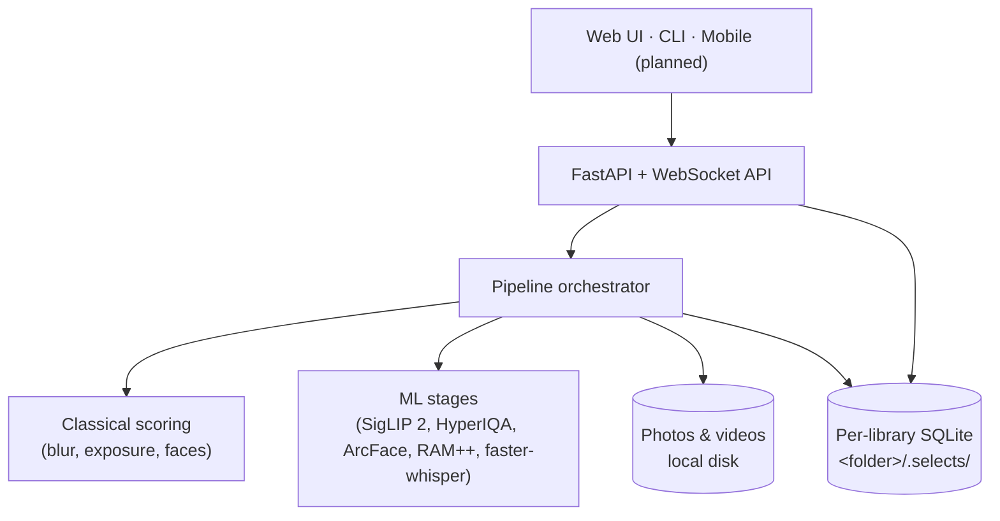

<div align="center">


# Selects

**Cull thousands of travel photos down to your keepers — locally, privately, on your own machine.**

Point it at a folder of photos and videos. It indexes, scores, clusters, and groups them into
day-by-day stories, surfaces the best shots, and gets out of your way. Nothing is uploaded anywhere.
(The Map view is an exception: it loads OpenStreetMap tiles from the internet, and reverse
geocoding of GPS coordinates into place names is optional and can be disabled.)

[](https://pypi.org/project/selects/)
[](https://www.python.org/)
[](https://github.com/bihanikeshav/selects/actions/workflows/ci.yml)
[](LICENSE)

</div>

---

## Why Selects

I built Selects for the post-trip mess: 3,000 photos, five versions of the same mountain, ten blurry food shots, and one frame where everyone actually has their eyes open.

The app is meant to do the boring first pass locally, then leave the final taste call to you.

| | |
|---|---|
| **Private by design** | All inference runs locally. No cloud, no account, no upload. |
| **More than EXIF sorting** | Semantic search, face grouping, aesthetic scoring, eyes-open burst picking. |
| **Photos and video** | Scene-aware highlights, unusable-clip flags, keep/reject on clips and moments. |
| **Fast to cull** | Keyboard-first review, side-by-side compare, learns your taste. |
| **Yours to extend** | Clean FastAPI backend + React UI + a scriptable CLI. |

The only network call is an optional place-name lookup for geotagged shots.

## Features

| Feature | What it does |
|---|---|
| Discovery search | Natural-language + tag search over on-device SigLIP 2 embeddings |
| Auto tagging | Zero-shot + RAM++ open-vocabulary labels |
| People | ArcFace embeddings clustered into named "Person" identities |
| Face-aware culling | Eyes-open / head-pose scoring picks the best frame in a burst |
| Stories | GPS + time clustering into day-by-day, place-by-place trips |
| Aesthetic curation | HyperIQA (in-the-wild) + prompt IQA, percentile "best-of" gating |
| Duplicate finder | Exact + near-duplicate report with reclaimable-storage summary |
| Keyboard culling | Arrow-key review, undo, 100% zoom, synced-zoom compare |
| Taste learning | A local model that nudges scoring toward your keep/reject history |
| Export | Copy/zip keepers or write XMP star ratings to Lightroom/darktable |
| Trip recap | A self-contained shareable HTML keepsake per trip |
| Video culling | 1-second timeline, hard-dead vs scenic stillness, highlight peaks, keyboard keep/reject |
| Transcripts | Local faster-whisper for speech, silence/filler selects, search by what was said |
| Models page | See what's on disk vs missing; download SigLIP 2, RAM++, HyperIQA, InsightFace, Whisper |
| Watch folder | Point it at your camera dump; new files index automatically |

## Install

**One line (recommended)** — installs via [uv](https://docs.astral.sh/uv/), which brings its own
Python, so there is nothing to install first and no downloaded app for macOS Gatekeeper or Windows
SmartScreen to flag. It opens the web UI; AI models download from the app's first-run setup screen.

```bash
# macOS / Linux
curl -LsSf https://bihanikeshav.github.io/selects/install.sh | sh

# Windows (PowerShell)
irm https://bihanikeshav.github.io/selects/install.ps1 | iex
```

**Desktop bundle** — prefer a self-contained download? Grab the bundle for your OS from
[Releases](https://github.com/bihanikeshav/selects/releases) and run it. No Python required; it
downloads its AI models on first launch. (Unsigned, so the OS shows a one-time "unverified" prompt —
right-click → Open on macOS, or More info → Run anyway on Windows.)

**Via pip / uv** (Python 3.11+):

```bash
uv tool install "selects[ml]"  # or: pip install "selects[ml]"
pip install selects            # base app + web GUI + CLI, no on-device AI
pip install "selects[ml,desktop]"  # AI + a native desktop window instead of a browser tab
selects doctor --fix           # NVIDIA: restore the CUDA wheel (insightface installs CPU ORT)
selects serve                  # open the web UI (port 8000; honors SELECTS_WEB_PORT)
selects index /path/to/trip    # or run headless from the CLI
```

RAM++ is an ONNX graph from the `selects-onnx` repo — it is already part of `[ml]`. No extra
`pip install` and no `recognize-anything` git checkout.

### Platform support

Windows `[ml]` installs ``onnxruntime-gpu[cuda,cudnn]`` plus ``nvidia-cublas`` (CUDA 13).
insightface and faster-whisper also depend on the CPU ``onnxruntime`` wheel, which pip
installs *over* the GPU build — run ``selects doctor --fix`` after install on NVIDIA.
macOS uses the default ``onnxruntime`` package (CoreML when present). Linux `[ml]` is CPU
unless you install ``onnxruntime-gpu`` yourself.

SigLIP 2, RAM++, and HyperIQA load on CUDA → DirectML → CoreML → CPU and fall back if a
provider rejects an op. faster-whisper uses CTranslate2 CUDA when present, otherwise int8
CPU. `selects doctor` and the **Models** page show which provider this machine selected.

| Platform | Photo scoring | Notes |
|---|---|---|
| Windows (x64) | CUDA, then CPU | `selects doctor --fix` after `[ml]` on NVIDIA |
| macOS (Apple Silicon) | CoreML, then CPU | bundled in the CPU `onnxruntime` wheel |
| macOS (Intel) | CPU | — |
| Linux (x64) | CPU extra; CUDA if you install `onnxruntime-gpu` | |

## Architecture

**API-first**: a FastAPI backend does all the work; every client — web UI, CLI, future mobile — is
just another consumer of the same `/api` surface. State lives in a per-library SQLite DB inside the
photo folder (`<folder>/.selects/`), so a library is self-contained and portable.



Each stage reads/writes `<folder>/.selects/index.db` and is independently re-runnable via
`selects index <folder> --pass <stage>`:

| # | Stage | Does |
|---|---|---|
| 1 | `index` | walk & hash files, decode previews/thumbnails, read EXIF/GPS |
| 2 | `video` | 1 s timeline, scene/dead/highlight segments, optional Whisper + face enrichment |
| 3 | `classical` | blur / exposure / clipped-highlight / face scoring; auto-reject gate |
| 4 | `embed` | SigLIP 2 SO400M image embeddings + prompt IQA |
| 5 | `aesthetic` | HyperIQA in-the-wild quality (KonIQ-10k) |
| 6 | `tag` | zero-shot tagging via SigLIP 2 text-prompt similarity |
| 7 | `ram_tag` | RAM++ open-vocabulary tagging |
| 8 | `smart_tag` | HDBSCAN clustering over embeddings + SigLIP 2 zero-shot names |
| 9 | `face_embed` | ArcFace embeddings for detected faces |
| 10 | `persons` | cluster ArcFace embeddings into named Person identities |
| 11 | `moment` | collapse near-duplicate/burst photos into one best pick |
| 12 | `story` | build day/place stories from moments, tags, and locations |
| 13 | `thematic` | rule-driven location/theme clusters from GPS, people, tags, time |
| 14 | `date` | group photos by calendar day |

`speed_mode=fast` skips `ram_tag`, `smart_tag`, `face_embed`, `persons`, and video Whisper /
InsightFace enrichment. Aesthetic curation
ranks on HyperIQA when present, else prompt IQA (`Embedding.aesthetic_iqa` in [0, 1]), with
configurable per-scope and library-wide percentile thresholds (see [Configuration](#configuration)).
After upgrading to SigLIP 2, re-run `selects index <folder> --pass embed` (and `aesthetic`) so
stored vectors match the new towers.

## Photography editor / grading candidates

The optional second-stage photography workflow uses a wider candidate pool and
cached previews, keeping visual grading potential separate from machine aesthetic
scores. It adds no vision model or database migration:

```bash
selects creative candidates /path/to/trip --percentile 50 --batch-size 50
selects creative import /path/to/trip /path/to/trip/.selects/creative/batch_0001.json
selects creative shortlist /path/to/trip --heroes 12 --grades 40 --story 80
selects creative report /path/to/trip
selects creative xmp /path/to/trip --dry-run
```

Grades includes heroes; story includes both. Reports live in `.selects/creative/`.
XMP defaults to dry-run and applies only sidecars, preserving original image bytes.
See the [CLI and review contract](docs/creative-curation.md) and
[travel-photo-curator Skill](skills/travel-photo-curator/SKILL.md).

## Roadmap

**Shipped (v0.1)**
- [x] Discovery search, tagging, people, face-aware culling
- [x] Stories, aesthetic curation, duplicate finder
- [x] Keyboard culling + compare, taste learning
- [x] Export (copy/zip + XMP), trip recap, watch folder
- [x] Video highlights, clip/moment cull, local transcripts, Models page
- [x] CPU desktop builds for Windows, macOS, Linux + PyPI package
- [x] CUDA / CoreML GPU path (Windows `onnxruntime-gpu` + `selects doctor --fix`)

**Planned**
- [ ] **Android companion** — LAN remote that drives the desktop backend from your phone
- [ ] **Android standalone** — on-device culling for small libraries (no desktop needed)
- [ ] Cursor-based pagination, auto-tuned aesthetic/burst thresholds, iOS parity

## Quickstart (from source)

Requires Python 3.11+ and Node 18+.

```bash
pip install -e ".[ml]"        # ML stack (onnxruntime, insightface, sklearn, …); omit [ml] for classical-only
selects serve /path/to/photos # backend + web UI (indexes in the background)

cd frontend && npm install && npm run dev   # hot-reloading UI (separate terminal)
```

`selects serve` opens the web UI (`--no-browser` to skip) and indexes in the background
(`--no-background` to skip). With the frontend built once (`npm run build`), the backend serves the
UI same-origin — no `npm run dev` needed. With **no folder argument** it opens the active library, or
onboarding if none exists. Drive stages directly with `selects index <folder> [--pass <stage>]` and
check hardware with `selects doctor`.

### macOS (Apple Silicon)

No Docker or other services are needed; the models run in-process on ONNX Runtime. Use a native
arm64 Python. An Intel Homebrew install (`/usr/local`) runs as x86_64 under Rosetta, and there
`umap-learn`'s `llvmlite` dependency has no wheel, so it tries to build from source and fails.
[uv](https://docs.astral.sh/uv/) can fetch a native interpreter:

```bash
uv venv --managed-python --python cpython-3.11-macos-aarch64 .venv
uv pip install --python .venv/bin/python -e ".[ml,dev]"
.venv/bin/python -c "import platform; print(platform.machine())"   # expect: arm64
.venv/bin/selects serve /path/to/photos
```

The first ML run (or the **Models** page) downloads weights into `~/.cache/selects/models/`
(`SELECTS_MODELS_DIR` to override): `siglip2/` (~2.3 GB), `ram-plus/` (~1.6 GB), `hyperiqa/`
(~105 MB), `buffalo_l/` (~330 MB), and `whisper-small/` (~490 MB). Older InsightFace installs
under `~/.insightface/models/` still count as present. Downloads use plain HTTP because Selects
sets `HF_HUB_DISABLE_XET=1` by default;
the Hub's Xet downloader can hang mid-file. Set `HF_HUB_DISABLE_XET=0` to opt back in, and
`HF_TOKEN` for faster, less rate-limited downloads.

Video-only folders show up under **Videos** in the sidebar. The photo views (Cull, Curated, People,
Map) stay empty for them.

## Configuration

`selects serve` binds **8000** by default. If `--port` is omitted, it honors `SELECTS_WEB_PORT`.
Per-folder settings via `pydantic-settings`; override any field with a `SELECTS_`-prefixed env
var (or `.env`). See `selects/config.py`.

| Field | Default | Notes |
|---|---|---|
| `web_port` | `8000` | Web UI/API port (`selects serve` / `SELECTS_WEB_PORT`) |
| `web_host` | `127.0.0.1` | Bind host |
| `burst_window_seconds` | `12` | Time window for grouping burst shots |
| `burst_similarity_threshold` | `0.96` | Similarity cutoff for burst grouping |
| `aesthetic_per_scope_pct` | `75.0` | CLIP-IQA: must be top `(100 - pct)`% within its scope |
| `aesthetic_library_pct` | `50.0` | CLIP-IQA: must also be top `(100 - pct)`% library-wide |
| `speed_mode` | `full` | `fast` skips `ram_tag`, `smart_tag`, `face_embed`, `persons`, video Whisper |

Derived paths under `<folder>/.selects/`: `index.db`, `thumbs/`, `previews/`.

**Per-trip customization** — drop optional JSON into `<folder>/.selects/` (missing/malformed falls
back to defaults); see [`examples/ladakh/`](examples/ladakh/):

| File | Purpose |
|---|---|
| `landmarks.json` | Named GPS landmarks — fast-path override for reverse geocoding |
| `keywords.json` | Theme buckets for pattern/thematic stories |
| `tag_prompts.json` | Zero-shot SigLIP tag taxonomy |

## Development

```bash
pip install -e ".[dev]" && pytest && ruff check .
cd frontend && npm run lint && npm run e2e   # ESLint + Playwright smoke test
```

`npm run e2e` needs Chromium once (`npx playwright install chromium`). It builds the SPA into
`selects/server/static/`, indexes a throwaway six-photo library in the temp directory and drives the
real server on port 8765. Point `SELECTS_PYTHON` at the interpreter that has `selects` installed if
it is not the one on `PATH`. Use an absolute path, because the fixture runs it from the repo root
(e.g. `SELECTS_PYTHON="$PWD/../.venv/bin/python" npm run e2e` from `frontend/` on macOS/Linux, or
`...\.venv\Scripts\python.exe` on Windows).

For the native desktop window (`pywebview`), install `selects[desktop]` (or `selects[ml,desktop]`
for AI + the desktop window).

Schema is managed with Alembic; migrations ship in `selects/db/migrations/` (no `alembic.ini`) and
`init_db()` upgrades each library's DB to head on open. After editing `selects/db/models.py`,
autogenerate a revision against a throwaway SQLite URL and review it — SQLite ALTERs go through
`render_as_batch` (enabled in `env.py`).

**Layout**

| Path | Contents |
|---|---|
| `selects/` | Package: CLI, config, pipeline, DB models |
| `selects/classical/` | Non-ML scoring (blur, exposure, faces, auto-reject) |
| `selects/decode/` | Image / video / RAW decoding |
| `selects/indexer/` | Folder walking, EXIF, previews, orchestration |
| `selects/ml/` | Embedding, tagging, faces, clustering, stories, video cull, Whisper |
| `selects/server/` | FastAPI app, routes, WebSocket progress bus |
| `frontend/` | React + Vite + TypeScript web UI |
| `tests/` · `docs/` | Test suite · landing page (GitHub Pages) |

**Desktop build** — `pip install "pyinstaller>=6.6"` then `python packaging/build.py [--ml]`. It
builds the frontend into `selects/server/static/` (same-origin UI) and runs PyInstaller (onedir) via
`packaging/selects.spec` into `dist/selects/`.

## Contributing

1. Fork, branch, `pip install -e ".[dev]"`, add tests under `tests/`.
2. `pytest` and `ruff check .` must be green.
3. Open a PR — the [architecture](#architecture) and [roadmap](#roadmap) are the best places to find direction.

**Good first areas:** GPU execution providers, the mobile client (the API already exists), export
formats, and tuning aesthetic/burst defaults for different shooting styles.

## Known limitations

- [ ] Aesthetic/burst thresholds were tuned on a single trip; may need adjustment for other styles/gear.
- [ ] List endpoints use offset/limit, not cursor-based, pagination.

## License

MIT — see [LICENSE](LICENSE).
